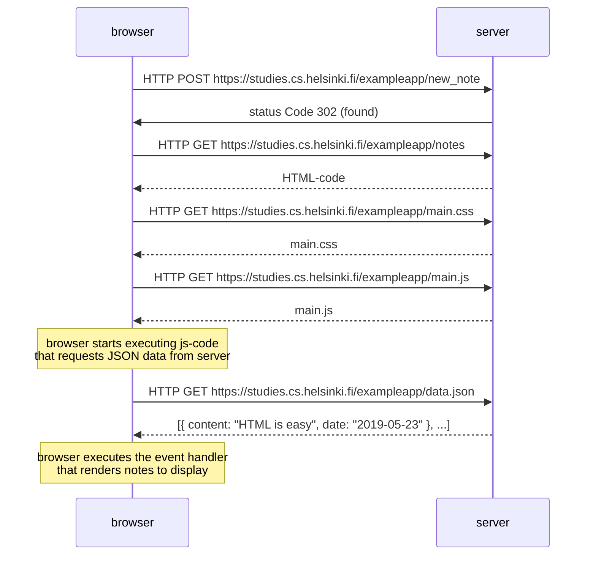
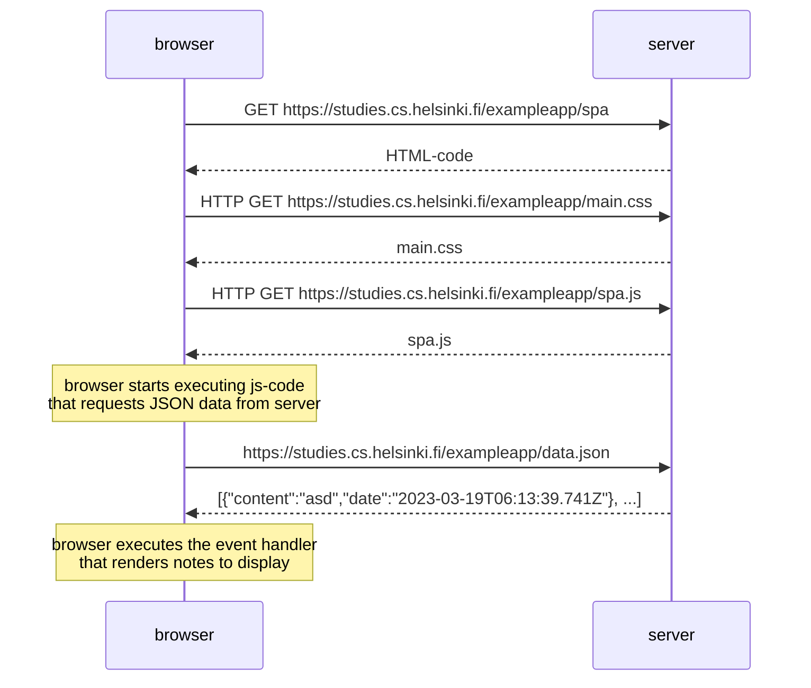

##0.4

```mermaid
sequenceDiagram
browser->>server: HTTP POST https://studies.cs.helsinki.fi/exampleapp/new_note
server->>browser: status Code 302 (found)
browser->>server: HTTP GET https://studies.cs.helsinki.fi/exampleapp/notes
server-->>browser: HTML-code
browser->>server: HTTP GET https://studies.cs.helsinki.fi/exampleapp/main.css
server-->>browser: main.css
browser->>server: HTTP GET https://studies.cs.helsinki.fi/exampleapp/main.js
server-->>browser: main.js
Note over browser: browser starts executing js-code<br/>that requests JSON data from server 
browser->>server: HTTP GET https://studies.cs.helsinki.fi/exampleapp/data.json
server-->>browser: [{ content: "HTML is easy", date: "2019-05-23" }, ...]
Note over browser: browser executes the event handler<br/>that renders notes to display
```

##0.5

```mermaid
sequenceDiagram

browser->>server: GET https://studies.cs.helsinki.fi/exampleapp/spa
server-->>browser: HTML-code
browser->>server: HTTP GET https://studies.cs.helsinki.fi/exampleapp/main.css
server-->>browser: main.css
browser->>server: HTTP GET https://studies.cs.helsinki.fi/exampleapp/spa.js
server-->>browser: spa.js

Note over browser: browser starts executing js-code <br/> that requests JSON data from server

browser->>server: https://studies.cs.helsinki.fi/exampleapp/data.json
server-->>browser: [{"content":"asd","date":"2023-03-19T06:13:39.741Z"}, ...]

Note over browser: browser executes the event handler <br/> that renders notes to display
```

